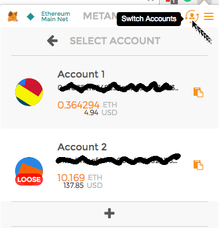

# MetaMask Users FAQ

## Information on Buying Ether Within MetaMask

Check out our [Coinbase guide](./COINBASE.md)

## Using a local node

To run MetaMask against a local node you will need to lookup the url for the extension and list it as a CORS domain.
You can find the extension ID in the extensions panel `chrome://extensions/`.
Start geth with the following command, using your unique correct extension ID:
`geth --rpc --rpccorsdomain="chrome-extension://pgfcgpgggeefgnajgbdojefgdddlgnpi"`.

## Sandboxing MetaMask

 If you are concerned about giving strong permissions to a Chrome extension, you can use a separate Chrome profile for Metamask

 
 
## Managing Tokens

MetaMask does not currently display your token balances, but that doesn't mean you can't manage your tokens with MetaMask!

Since MetaMask allows any website to interact with the blockchain, you can use any token managing UI you like to view and send tokens.

A few popular options are:
- [The Ethereum Wallet](https://wallet.ethereum.org/)
- [Token Ninja](https://tokenninja.github.io/)
- [Token Factory](https://tokenfactory.surge.sh/#/factory)

Just visit any of these sites with MetaMask installed, and you'll be able to manage your tokens freely. Remember that when transfering tokens, you still pay fees in Ether.

A good block explorer for token balances (view only, can't send)  is:
- https://ethplorer.io/

## Slow Transactions

If you submitted a transaction with a very low gas price, and it’s stuck pending without being mined, currently the only way to get MetaMask to forget about this tx and reset its nonce is to restore MetaMask to a fresh state.

To reset MetaMask’s state:

- Make sure you have your seed phrase backed up.
- Lock MetaMask (in the top right menu)
- Click “Forgot my Password (import)”
- Enter your seed phrase.
- You should be able to submit transactions again.

Please note these newly submitted transactions will be *competing with your previously submitted transactions* to be mined first, so there is no guarantee they will not be mined first. The only strategy to help the odds of the later transactions being mined first is to submit them with a higher gas price.

For advice on what gas prices will be mined with what urgency, refer to [Eth Gas Station](http://ethgasstation.info/).
 
## "Loose" Accounts

Suppose you used the **Import Account** capability to import an account. Now, when you click **Switch Accounts**, you see the word **Loose** with a bright red oval background superimposed on your account avatar.

The **Loose** label means that the account is not backed up by your seed phrase. This happened because you imported the account after creating your seed phrase.

As a precaution, keep the information you were using to access this "Loose" account backed up outside of MetaMask. (Similar to how you keep your seed phrase backed up somewhere offline.) This way, if something goes wrong, you can recover the account.

## Import Account
You can import external accounts into MetaMask.

### Introduction
To add a pre-existing account to MetaMask, use the *Import Account* menu item. Afterward, you can configure MetaMask to use the imported account by selecting it with the *Switch Accounts* menu item. 

**Warning**: Imported accounts are not protected by the seed phrase that was generated when you created your original MetaMask account and are therefore marked as *loose*. Therefore, back-up all account information for accounts before you import them to MetaMask.

### How to Import an Account

1. After logging into MetaMask, open the main menu and click **Import Account**.  
  .
2. Use **Select Type** to specify which authentication method you plan to use: **Private Key** or **JSON File**.  
  
3. Enter the private key or browse to your JSON file and follow the prompts. 
4. To verify that MetaMask has imported the account, click **Switch Accounts**. The imported account should appear in the list of accounts and should be marked "Loose".  
  

## Why are My Accounts Different Than My Client?

If you are running a full blockchain node like geth or parity, MetaMask can connect to it to allow a fully locally hosted experience, which includes greater decentralization, and faster load times.

These clients also allow you to create accounts within themselves.  Those accounts are not related to your MetaMask accounts at all! MetaMask creates and encrypts your accounts within its process, keeping them neatly secured from your blockchain process.

The only way to send a transaction from a MetaMask account is by using the MetaMask UI to approve a transaction.

That said, you can also export a MetaMask account, or import another account into MetaMask, but without these very deliberate steps, your accounts are very separate.

## How to change the MetaMask popup's font size (Chrome)

1. Visit `chrome-extension://ebjbdknjcgcbchkagneicjfpneaghdhb/popup.html` (this opens the popup in a browser window).
2. Use the browser zoom commands to zoom out a few clicks. This is in the `View` menu. The zoom size on this tab should also affect the popup.
