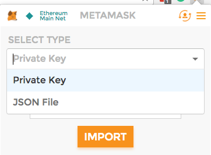

# MetaMask Users FAQ

## Information on Buying Ether Within MetaMask

Check out our [Coinbase guide](./COINBASE.md)

## Using a local node

To run MetaMask against a local node you will need to lookup the url for the extension and list it as a CORS domain.
You can find the extension ID in the extensions panel `chrome://extensions/`.
Start geth with the following command, using your unique correct extension ID:
`geth --rpc --rpccorsdomain="chrome-extension://pgfcgpgggeefgnajgbdojefgdddlgnpi"`.

## Sandboxing MetaMask

 If you are concerned about giving strong permissions to a Chrome extension, you can use a separate Chrome profile for Metamask

 
 
## "Loose" Accounts

Suppose you used the **Import Account** capability to import an account. Now, when you click **Switch Accounts**, you see the word **Loose** with a bright red oval background superimposed on your account avatar.

The **Loose** label means that the account is not backed up by your seed phrase. This happened because you imported the account after creating your seed phrase.

As a precaution, keep the information you were using to access this "Loose" account backed up outside of MetaMask. (Similar to how you keep your seed phrase backed up somewhere offline.) This way, if something goes wrong, you can recover the account.

## Import Account
You can import external accounts into MetaMask.

### Introduction
To add a pre-existing account to MetaMask, use the *Import Account* menu item. Afterwards, you can configure MetaMask to use the imported account by selecting it with the *Switch Accounts* menu item. 

**Warning**: Imported accounts are not protected by the seed phrase that was generated when you created your original MetaMask account and are therefore marked as *loose*. Therefore, back-up all account information for accounts before you import them to MetaMask.

### How to Import an Account

1. After logging into MetaMask, open the main menu and click **Import Account**.  
  .
2. Use **Select Type** to specify which authentication method you plan to use: **Private Key** or **JSON File**.  
  
3. Enter the private key or browse to your JSON file and follow the prompts. 
4. To verify that MetaMask has imported the account, click **Switch Accounts**. The imported account should appear in the list of accounts and should be marked "Loose".  
  

